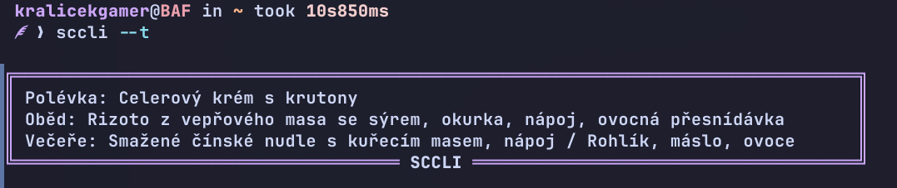

# Strava.cz CLI (SCCLI)
Jednoduchý program pro příkazovou řádku, který umožňuje zobrazení přihlášených jídel ze strava.cz přímo v terminálu.



## Instalace
```bash
curl -s https://raw.githubusercontent.com/kralicekgamer/sccli/refs/heads/main/install.sh | bash
```

## Příkazy
```bash
# Zobrazit nápovědu
sccli -h

# Zobrazit všechna dnešní přihlášená jídla
sccli --today
sccli --today all

# Zobrazit jen dnešní oběd
sccli --today obed

# Zobrazit jen dnešní večeři
sccli --today vecere

# Zobrazí jídelníček na zítra
sccli --next

# Smazat uložené přihlašovací údaje (odhlášení)
sccli --delete
```

## Odinstalace
```bash
curl -s https://raw.githubusercontent.com/kralicekgamer/sccli/refs/heads/main/uninstall.sh | bash
```